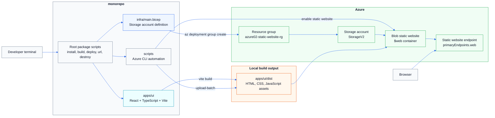

# Azure 02 - Deploy A Website To Azure Blob Static Website Hosting

## Introduction

In this lesson, you build and deploy a real React application to Azure using a small production-style monorepo.

The application is an All Checks Out console built with React, TypeScript, Vite, Tailwind CSS, and shadcn-style UI components. It has client-side routing, a role-scoped demo sign-in flow, app navigation, global search, dark-mode persistence, and typed fixture data for authorities, participants, stakeholders, cases, and tasks. That gives us a useful frontend without adding a backend before the course needs one.

The infrastructure is written in Bicep. Bicep creates an Azure Storage account, and the deployment scripts enable Azure Blob static website hosting for the built frontend files. The Vite build output is uploaded into the special `$web` container, and Azure serves the app from the storage account's static website endpoint.

The important lesson is not just "upload some files". The goal is to start shaping a cloud-native project the way we will keep shaping it throughout the Azure course:

- application code lives in `apps/ui`
- infrastructure code lives in `infra`
- repeatable automation lives in `scripts`
- root-level package scripts provide the learner-friendly workflow
- generated assets and deployed resources can be rebuilt from source

This is intentionally a modest deployment. It does not add Azure Front Door, Microsoft Entra External ID, an API, or a database yet. Those belong to later lessons. Here we focus on the first solid milestone: build a modern frontend, provision Azure hosting with infrastructure as code, upload the production bundle, and verify the live site.

## Mermaid Diagram



## Release Notes

- **The project now has a clean Azure monorepo.** The `monorepo` folder contains the frontend application, Bicep infrastructure, deployment scripts, workspace configuration, and lockfile needed for this lesson.
- **The frontend is a Vite React app.** The UI uses React, TypeScript, React Router, Tailwind CSS, lucide icons, and shadcn-style primitives for buttons, inputs, and dropdown menus.
- **The app includes real client-side behavior.** Students can sign into a scoped demo account, search apps/cases/organizations/tasks, browse case-management and administration screens, submit demo page actions, use breadcrumb navigation, and switch between light and dark themes.
- **Infrastructure is written in Bicep.** `infra/main.bicep` creates an Azure Storage account using `StorageV2`, `Standard_LRS`, and a deterministic globally valid account name.
- **Static website hosting is enabled by script.** The deployment script uses Azure CLI to enable static website hosting with `index.html` as both the index document and the not-found document.
- **Single-page app routing is supported for this lesson.** Because the not-found document is also `index.html`, direct visits to routes such as `/cases` or `/admin/participants` return the React app instead of a storage error page.
- **The upload script publishes the Vite build.** `scripts/upload-ui.sh` uploads `apps/ui/dist` into the `$web` container with overwrite enabled.
- **Root scripts hide command complexity.** Students can run `pnpm run deploy-everything` for the full path, or run `infra:deploy`, `ui:build`, `ui:upload`, and `ui:url` one step at a time from the repository root.
- **The live URL can be printed after deployment.** `pnpm run ui:url` reads the deployed storage account and prints the Azure Blob static website endpoint so it can be opened directly from the terminal.
- **Configuration is environment-driven.** `scripts/config.sh` provides sensible defaults while still allowing `AZURE_LOCATION`, `AZURE_RESOURCE_GROUP`, `AZURE_DEPLOYMENT_NAME`, `AZURE_APP_NAME`, `AZURE_STORAGE_AUTH_MODE`, and `UI_DIST_DIR` to be overridden.
- **Teardown is included.** `pnpm run infra:destroy` deletes the resource group so the lesson can be repeated cleanly.

## How To Run

Most commands can be run from the repository root. The root `package.json` delegates to the implementation scripts in `monorepo`.

**Install dependencies**

```bash
pnpm --dir monorepo install
```

**Run the app locally**

```bash
pnpm run ui:dev
```

Vite starts a local development server. Open the local URL shown in the terminal and confirm that the sign-in flow loads, the role-scoped console routes work, global search returns console results, and the theme button toggles dark mode.

**Run local checks**

```bash
pnpm run type-check
pnpm run ui:build
pnpm run ui:preview
```

The `type-check` command confirms the TypeScript project is healthy. The `ui:build` command creates the production bundle in `apps/ui/dist`. The `ui:preview` command serves that production bundle locally, which is closer to the way Azure will serve it.

**Deploy infrastructure**

```bash
pnpm run infra:deploy
```

This command creates the resource group if needed, deploys the Bicep template, and enables static website hosting on the storage account.

**Deploy the website files**

```bash
pnpm run deploy-website
```

This builds the Vite app and uploads the generated files to the static website container.

**Show the live URL**

```bash
pnpm run ui:url
```

Open the printed URL in a browser. The site is being served by Azure Blob static website hosting.

**Deploy everything in one command**

```bash
pnpm run deploy-everything
```

This is the happy-path command once students understand the individual steps. It deploys infrastructure, builds the app, uploads the files, and prints the live URL.

**Tear down**

```bash
pnpm run infra:destroy
```

This deletes the resource group and the resources created for the lesson.

## Prerequisites

You need:

- Node.js
- pnpm
- Azure CLI
- an Azure subscription
- a signed-in Azure CLI session

Check the Azure CLI account:

```bash
az account show --output table
```

If you are not signed in:

```bash
az login
```

If you have access to multiple subscriptions, select the one you want to use:

```bash
az account set --subscription "<subscription-id-or-name>"
```

## Monorepo Structure

```text
.
├── package.json
└── monorepo
    ├── apps
    │   └── ui
    │       ├── src
    │       ├── index.html
    │       ├── package.json
    │       ├── tsconfig.json
    │       └── vite.config.ts
    ├── infra
    │   └── main.bicep
    ├── scripts
    │   ├── config.sh
    │   ├── deploy-infra.sh
    │   ├── destroy-infra.sh
    │   ├── show-url.sh
    │   ├── upload-ui.sh
    │   └── what-if-infra.sh
    ├── package.json
    ├── pnpm-lock.yaml
    └── pnpm-workspace.yaml
```

The structure is deliberately small. A single application, a single infrastructure template, and a handful of scripts are enough to teach the first deployment pattern without hiding the important details.

## Frontend App

The frontend lives in `monorepo/apps/ui`.

It uses:

- React for UI components
- TypeScript for safer application code
- Vite for local development and production builds
- React Router for browser routes
- Tailwind CSS for styling
- shadcn-style UI primitives for common controls
- lucide-react for icons

The important files are:

```text
apps/ui/src/App.tsx
apps/ui/src/pages/ConsolePages.tsx
apps/ui/src/pages/SignInPage.tsx
apps/ui/src/pages/NotFound.tsx
apps/ui/src/components/ConsoleLayout.tsx
apps/ui/src/components/Header.tsx
apps/ui/src/context/AuthContext.tsx
apps/ui/src/context/ThemeContext.tsx
apps/ui/src/data/console.ts
```

`App.tsx` sets up the browser router, auth provider, and theme provider. Signed-out users see the demo sign-in page. Signed-in users are routed by role: authority admins land on participants, participants land on cases, and stakeholders land on the stakeholder portal.

`ConsolePages.tsx` renders the administration, case-management, task-detail, and assurance-portal screens. The pages share layout, tables, metrics, breadcrumbs, tabs, and demo action buttons.

`ConsoleLayout.tsx` provides the common console shell for page content. Breadcrumb navigation warns about pending demo changes until the user presses the page's affirmative action button, such as `Save case` or `Submit task update`.

`Header.tsx` provides the app launcher, global search, current scope, account menu, and theme toggle.

`AuthContext.tsx` is a temporary demo auth layer. It stores the signed-in role and selected scope in `localStorage`. Later lessons can replace this with Microsoft Entra External ID without changing the overall monorepo shape.

`ThemeContext.tsx` stores the light or dark preference in `localStorage`. `App.tsx` applies the `dark` class to the document element so Tailwind can switch the theme variables.

`console.ts` contains typed fixture data for the demo. The model separates the main party types and links them by dataless IDs:

- `Authority` has an `id`, `name`, and descriptive metadata.
- `Participant` has an `id`, `name`, `authorityId`, and `stakeholderId`.
- `Stakeholder` has an `id` and `name`.
- `CaseRecord` references a participant by `participantId`.

The model intentionally avoids a generic `owner` field because ownership is ambiguous in this domain. Screens resolve IDs to display names through helper functions such as `getAuthority`, `getParticipant`, and `getStakeholder`.

## Infrastructure

The infrastructure lives in `monorepo/infra/main.bicep`.

The template creates one storage account:

```bicep
resource websiteStorage 'Microsoft.Storage/storageAccounts@2023-05-01' = {
  name: storageAccountName
  location: location
  sku: {
    name: 'Standard_LRS'
  }
  kind: 'StorageV2'
  properties: {
    allowBlobPublicAccess: true
  }
}
```

The account name is generated from the `appName` parameter and `uniqueString(resourceGroup().id)`. That matters because Azure Storage account names must be globally unique, lowercase, and no longer than 24 characters.

The template outputs the storage account name:

```bicep
output storageAccountName string = websiteStorage.name
```

The scripts read that output after deployment. That keeps the learner from manually copying storage account names between commands.

Static website hosting itself is enabled by Azure CLI in `scripts/deploy-infra.sh`:

```bash
az storage blob service-properties update \
  --account-name "$STORAGE_ACCOUNT_NAME" \
  --static-website \
  --index-document index.html \
  --404-document index.html \
  --auth-mode "$AZURE_STORAGE_AUTH_MODE"
```

The key detail is the not-found document. This React app uses browser routing. If a user visits `/cases` or `/admin/participants` directly, Azure Blob static website hosting does not know that route exists as a physical file. Returning `index.html` lets React Router take over in the browser.

## Deployment Scripts

The scripts live in `monorepo/scripts`.

`config.sh` defines shared defaults:

```bash
AZURE_LOCATION="${AZURE_LOCATION:-uksouth}"
AZURE_RESOURCE_GROUP="${AZURE_RESOURCE_GROUP:-azure02-static-website-rg}"
AZURE_DEPLOYMENT_NAME="${AZURE_DEPLOYMENT_NAME:-azure02-static-website}"
AZURE_APP_NAME="${AZURE_APP_NAME:-azure02web}"
AZURE_STORAGE_AUTH_MODE="${AZURE_STORAGE_AUTH_MODE:-key}"
UI_DIST_DIR="${UI_DIST_DIR:-apps/ui/dist}"
```

You can override these values for a one-off deployment:

```bash
AZURE_LOCATION=westeurope AZURE_RESOURCE_GROUP=my-all-checks-out-rg pnpm run deploy-everything
```

`deploy-infra.sh` creates the resource group, deploys Bicep, reads the storage account name from the deployment output, and enables static website hosting.

`what-if-infra.sh` runs an Azure deployment preview. This is useful before making infrastructure changes:

```bash
pnpm run infra:what-if
```

`upload-ui.sh` reads the storage account name from the deployment output and uploads the built frontend:

```bash
az storage blob upload-batch \
  --account-name "$STORAGE_ACCOUNT_NAME" \
  --destination '$web' \
  --source "$UI_DIST_DIR" \
  --overwrite true \
  --auth-mode "$AZURE_STORAGE_AUTH_MODE"
```

The `$web` container is created by Azure when static website hosting is enabled. Files in this container are served by the static website endpoint.

`show-url.sh` reads the storage account name from the deployment output, then asks Azure for the storage account's `primaryEndpoints.web` value. This avoids making the learner hunt through the Azure portal after deployment.

`destroy-infra.sh` deletes the whole resource group. That is simple and appropriate for this lesson because the resource group is dedicated to this deployment.

## Package Scripts

The repository-root `package.json` is the learner-facing command surface. It delegates into the monorepo so students can run commands from the top of the repo:

```json
{
  "scripts": {
    "ui:url": "pnpm --dir monorepo run ui:url",
    "deploy-everything": "pnpm --dir monorepo run deploy-everything"
  }
}
```

Inside `monorepo`, `package.json` owns the actual UI, infrastructure, deployment, and cleanup commands:

```json
{
  "scripts": {
    "infra:deploy": "bash scripts/deploy-infra.sh",
    "infra:what-if": "bash scripts/what-if-infra.sh",
    "infra:destroy": "bash scripts/destroy-infra.sh",
    "ui:dev": "pnpm -C apps/ui run dev",
    "ui:build": "pnpm -C apps/ui run build",
    "ui:preview": "pnpm -C apps/ui run preview",
    "ui:upload": "bash scripts/upload-ui.sh",
    "ui:url": "bash scripts/show-url.sh",
    "deploy-website": "pnpm run ui:build && pnpm run ui:upload",
    "deploy-everything": "pnpm run infra:deploy && pnpm run deploy-website && pnpm run ui:url",
    "type-check": "pnpm -r type-check",
    "package-cleanup": "pnpm -r package-cleanup && rm -rf node_modules"
  }
}
```

This gives students two modes of working.

For learning, they can run one command at a time and see exactly what each step does.

For daily work, they can use the composed commands:

```bash
pnpm run deploy-website
pnpm run deploy-everything
```

## Build The Monorepo From Scratch

This section explains how to recreate the monorepo yourself.

### 1. Create The Folder

```bash
mkdir monorepo
cd monorepo
```

### 2. Create The Workspace

Create `package.json` at the monorepo root with scripts for the UI, infrastructure, deployment, URL lookup, and cleanup.

Create `pnpm-workspace.yaml`:

```yaml
packages:
  - "apps/ui"
allowBuilds:
  esbuild: true
  msw: true
```

The workspace only includes `apps/ui` for now. Infrastructure is handled through Azure CLI and Bicep, so it does not need a Node package.

### 3. Create The Vite App

Create the app folder:

```bash
mkdir -p apps/ui
```

The UI package needs React, React Router, Tailwind CSS, and the small component dependencies used by the app.

The app entry point is `apps/ui/src/main.tsx`. It finds the root DOM element, creates the React root, and renders `<App />`.

`apps/ui/src/App.tsx` wraps the app in providers and defines the routes:

```tsx
<Routes>
  <Route path="/" element={<Navigate to={getDefaultConsolePath(user.role)} replace />} />
  <Route path="/admin/participants" element={<ParticipantsPage />} />
  <Route path="/cases" element={<CaseManagementHome />} />
  <Route path="/cases/:caseId" element={<CaseDetailPage />} />
  <Route path="/stakeholder" element={<StakeholderPortalPage />} />
  <Route path="*" element={<NotFound />} />
</Routes>
```

This is enough to prove that static hosting can serve a modern client-side app with nested business routes, not just a single flat HTML page.

### 4. Add App State

Add two browser-backed contexts:

- `AuthContext` for demo login/logout state
- `ThemeContext` for light/dark mode

Both contexts use `localStorage`, which means students can refresh the deployed app and see that the browser remembers their choice.

### 5. Add Console Data

Create `apps/ui/src/data/console.ts` with small typed arrays for the console demo. The important entity types are:

```ts
Authority
Participant
Stakeholder
CaseRecord
Task
```

Use dataless relationship keys between entities. For example, `Participant` should store `authorityId` and `stakeholderId`, and `CaseRecord` should store `participantId`. Avoid a generic `owner` field; it is too ambiguous for this domain.

The console pages import this data, scope it to the signed-in demo user, and render role-appropriate administration, case-management, and stakeholder views.

### 6. Add Bicep

Create `infra/main.bicep`.

Define parameters for the deployment region and app name. Then create a storage account with a generated account name. Output the account name and the static website endpoint so scripts can read them later.

This keeps the infrastructure declarative. The account can be recreated in a new resource group without changing hard-coded names in the scripts.

### 7. Add Azure CLI Scripts

Create a shared `scripts/config.sh` first so every script uses the same resource group, deployment name, region, app name, and UI build folder.

Then add:

- `deploy-infra.sh`
- `what-if-infra.sh`
- `upload-ui.sh`
- `show-url.sh`
- `destroy-infra.sh`

Make the scripts executable:

```bash
chmod +x scripts/*.sh
```

The scripts should always read Azure state instead of asking the learner to paste values. For example, `show-url.sh` reads the storage account name from the deployment output, then prints the storage account's current static website endpoint.

Add a repository-root `package.json` as a convenience wrapper so learners can run the same commands from the top of the repo:

```json
{
  "scripts": {
    "ui:url": "pnpm --dir monorepo run ui:url",
    "deploy-everything": "pnpm --dir monorepo run deploy-everything"
  }
}
```

### 8. Install, Build, And Verify

Install dependencies:

```bash
pnpm install
```

Run the checks:

```bash
pnpm run type-check
pnpm run ui:build
```

Preview the built app:

```bash
pnpm run ui:preview
```

### 9. Deploy To Azure

Deploy everything:

```bash
pnpm run deploy-everything
```

Open the printed URL. Test:

- the sign-in page loads
- selecting an authority and role signs into the console
- `/cases` shows the case list for a case-management user
- `/admin/participants` shows the participant list for an authority admin
- `/stakeholder` shows the stakeholder portal for a stakeholder
- global search finds apps, cases, organizations, and tasks
- page action buttons clear the breadcrumb warning for demo navigation
- the theme toggle works
- refreshing `/cases` still returns the React app

## Troubleshooting

### Azure CLI Is Not Signed In

Symptom:

```text
Please run 'az login' to setup account.
```

Fix:

```bash
az login
```

### Wrong Subscription

Symptom: resources deploy to the wrong account, or deployment fails because the expected subscription is not active.

Check:

```bash
az account show --output table
```

Fix:

```bash
az account set --subscription "<subscription-id-or-name>"
```

### Upload Fails Because The App Has Not Been Built

Symptom:

```text
Build output not found at apps/ui/dist
```

Fix:

```bash
pnpm run ui:build
pnpm run ui:upload
```

### Direct Route Refresh Does Not Work

For this lesson, the deploy script sets both the index document and not-found document to `index.html`. If direct refreshes fail, rerun:

```bash
pnpm run infra:deploy
pnpm run deploy-website
```

Then test the route again.

### Permission Errors During Upload

The scripts default to Azure CLI account-key mode for storage operations:

```bash
AZURE_STORAGE_AUTH_MODE="${AZURE_STORAGE_AUTH_MODE:-key}"
```

In this mode the scripts read the storage account key and pass it explicitly to the Azure CLI storage commands. That avoids requiring a separate Storage Blob Data role for the tutorial upload and keeps the CLI output focused on the deployment. Your signed-in Azure identity still needs permission to read the storage account keys, which Owner and Contributor normally include.

If your organization disables shared key access, use Azure RBAC instead:

```bash
AZURE_STORAGE_AUTH_MODE=login pnpm run deploy-everything
```

In that mode, your signed-in Azure identity needs a blob data-plane role such as `Storage Blob Data Contributor` on the storage account or resource group.

## What You Have Learned

By the end of this lesson, you have:

- created a small Azure-focused monorepo
- built a React and TypeScript frontend with Vite
- organized application, infrastructure, and deployment automation separately
- written Bicep for an Azure Storage account
- enabled Azure Blob static website hosting
- uploaded a production frontend bundle to the `$web` container
- supported React Router refreshes with the static website not-found document
- used Azure CLI deployment outputs to avoid manual copy-and-paste steps
- deployed, verified, and destroyed the lesson environment

That is a strong first Azure deployment. The project is small enough to understand completely, but it already has the shape we can extend in later lessons with authentication, APIs, databases, observability, messaging, and more production-grade hosting.
