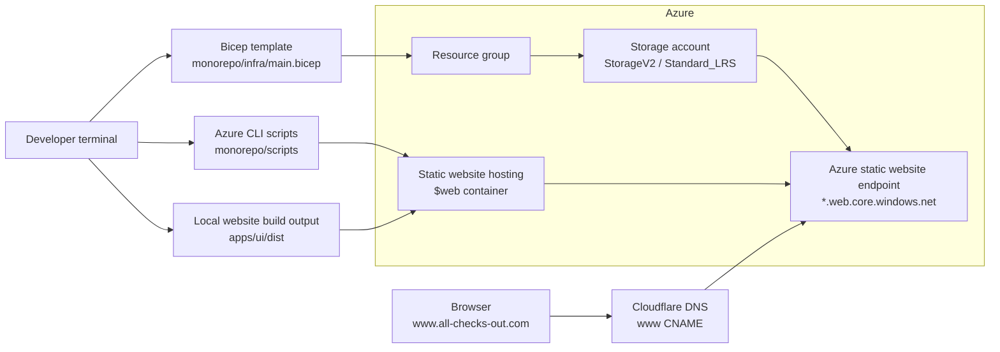

# Azure 03 - Deploy To A Registered Domain

## Overview

This lesson deploys the same static website hosting pattern as Azure02, then points a registered domain at the Azure static website endpoint.

The Azure infrastructure is deliberately small:

- one Azure resource group
- one Azure Storage account
- Blob static website hosting enabled on that storage account
- the special `$web` container used by Azure static website hosting

The registered domain is managed in Cloudflare. The only manual DNS change used for this lesson is one proxied `www` CNAME record that points to the Azure static website endpoint.

## Architecture



## Prerequisites

You need:

- Node.js
- pnpm
- Azure CLI
- an Azure subscription
- a signed-in Azure CLI session
- a registered domain managed in Cloudflare

Check your Azure CLI account:

```bash
az account show --output table
```

Sign in if needed:

```bash
az login
```

Select a subscription if your account has access to more than one:

```bash
az account set --subscription "<subscription-id-or-name>"
```

## Deploy The Azure Website

Run commands from the repository root.

Install dependencies:

```bash
pnpm --dir monorepo install
```

Preview the infrastructure deployment:

```bash
pnpm --dir monorepo run infra:what-if
```

Deploy the Azure infrastructure:

```bash
pnpm --dir monorepo run infra:deploy
```

Build and upload the website files:

```bash
pnpm --dir monorepo run deploy-website
```

Print the Azure static website endpoint:

```bash
pnpm --dir monorepo run ui:url
```

The printed URL is the target for the Cloudflare `www` CNAME record.

## Configure The Registered Domain In Cloudflare

In Cloudflare DNS, add one CNAME record:

```text
Type: CNAME
Name: www
Target: azure02xxxxxxxxp4ruuk.z33.web.core.windows.net
Proxy status: Proxied
```

For this deployment, the DNS record is:

```text
www.all-checks-out.com.  1  IN  CNAME  azure02xxxxxxxxp4ruuk.z33.web.core.windows.net. ; cf_tags=cf-proxied:true
```

After Cloudflare has saved the record, visit:

```text
https://www.all-checks-out.com
```

## Configuration

The scripts use these defaults from `monorepo/scripts/config.sh`:

```bash
AZURE_LOCATION="${AZURE_LOCATION:-uksouth}"
AZURE_RESOURCE_GROUP="${AZURE_RESOURCE_GROUP:-azure02-static-website-rg}"
AZURE_DEPLOYMENT_NAME="${AZURE_DEPLOYMENT_NAME:-azure02-static-website}"
AZURE_APP_NAME="${AZURE_APP_NAME:-azure02web}"
AZURE_STORAGE_AUTH_MODE="${AZURE_STORAGE_AUTH_MODE:-key}"
UI_DIST_DIR="${UI_DIST_DIR:-apps/ui/dist}"
```

Override values inline when needed:

```bash
AZURE_LOCATION=westeurope AZURE_RESOURCE_GROUP=my-static-site-rg pnpm --dir monorepo run deploy-everything
```

## Infrastructure

The Bicep file for this lesson is `monorepo/infra/main.bicep`. It creates the Azure Storage account that will host the static website files.

The first two lines define the Azure region:

```bicep
@description('The Azure region where the storage account will be created.')
param location string = resourceGroup().location
```

`@description(...)` documents the parameter for anyone reading the template or viewing it through Azure tooling.

`param location string` creates a parameter called `location` with the type `string`.

`= resourceGroup().location` gives the parameter a default value. If the deployment command does not pass a location, Bicep uses the location of the resource group being deployed into.

The next block defines a short application name:

```bicep
@description('A short lowercase name used to build the storage account name.')
@minLength(3)
@maxLength(16)
param appName string = 'azure02web'
```

`@description(...)` explains why the parameter exists.

`@minLength(3)` and `@maxLength(16)` validate the value before Azure tries to create anything. This matters because the value is used as part of an Azure Storage account name, and storage account names have strict length rules.

`param appName string = 'azure02web'` creates the `appName` parameter and gives it a default value.

The next line creates the final storage account name:

```bicep
var storageAccountName = take('${appName}${uniqueString(resourceGroup().id)}', 24)
```

`var storageAccountName` creates a Bicep variable. Variables are calculated during deployment and are not Azure resources themselves.

`'${appName}${uniqueString(resourceGroup().id)}'` joins the short app name to a deterministic unique suffix based on the resource group id. The suffix helps make the storage account name globally unique while staying repeatable for the same resource group.

`take(..., 24)` limits the generated name to 24 characters, which is the maximum length for an Azure Storage account name.

The resource block creates the Azure Storage account:

```bicep
resource websiteStorage 'Microsoft.Storage/storageAccounts@2023-05-01' = {
  name: storageAccountName
  location: location
  sku: {
    name: 'Standard_LRS'
  }
  kind: 'StorageV2'
  properties: {
    allowBlobPublicAccess: true
  }
}
```

`resource websiteStorage` declares an Azure resource in Bicep and gives it the local symbolic name `websiteStorage`. Other parts of the template can refer to this symbolic name.

`'Microsoft.Storage/storageAccounts@2023-05-01'` tells Bicep the Azure resource type and API version to use.

`name: storageAccountName` sets the real Azure resource name from the variable created earlier.

`location: location` deploys the storage account to the parameter value from the first block.

`sku: { name: 'Standard_LRS' }` chooses the storage account pricing and replication option. `Standard_LRS` means standard performance with locally redundant storage.

`kind: 'StorageV2'` creates a general-purpose v2 storage account, which is the storage account type used for Blob static website hosting.

`properties: { allowBlobPublicAccess: true }` allows blob containers in this account to support public access settings. Static website hosting serves files publicly from the special `$web` container.

The final line outputs the storage account name:

```bicep
output storageAccountName string = websiteStorage.name
```

`output` exposes a value after deployment. The deployment scripts read this output so they can enable static website hosting and upload files without asking the learner to copy and paste the generated storage account name.

The Bicep file creates the storage account. One extra Azure infrastructure step is done by `monorepo/scripts/deploy-infra.sh` after the Bicep deployment: it enables Blob static website hosting on that storage account.

This is the Azure CLI command that enables static website hosting:

```bash
az storage blob service-properties update \
  --account-name "$STORAGE_ACCOUNT_NAME" \
  --static-website \
  --index-document index.html \
  --404-document index.html \
  "${STORAGE_AUTH_ARGS[@]}"
```

`index.html` is used as the 404 document so browser routes can be handled by the uploaded frontend.

The registered-domain infrastructure for this lesson is the Cloudflare DNS record. It is added manually in Cloudflare:

```text
www.all-checks-out.com.  1  IN  CNAME  azure02xxxxxxxxp4ruuk.z33.web.core.windows.net. ; cf_tags=cf-proxied:true
```

This maps `www.all-checks-out.com` to the Azure static website endpoint while Cloudflare proxies the request.

## Scripts

- `infra:deploy` creates the resource group, deploys Bicep, reads the storage account name, and enables Blob static website hosting.
- `infra:what-if` previews the Bicep deployment.
- `ui:build` builds the website into `apps/ui/dist`.
- `ui:upload` uploads `apps/ui/dist` into the `$web` container.
- `ui:url` prints the storage account's `primaryEndpoints.web` URL.
- `deploy-website` builds and uploads the website.
- `deploy-everything` deploys infrastructure, builds the website, uploads it, and prints the Azure static website endpoint.
- `infra:destroy` deletes the resource group.

## Project Structure

```text
.
├── README.md
└── monorepo
    ├── apps
    │   └── ui
    ├── infra
    │   └── main.bicep
    ├── scripts
    │   ├── config.sh
    │   ├── deploy-infra.sh
    │   ├── destroy-infra.sh
    │   ├── show-url.sh
    │   ├── upload-ui.sh
    │   └── what-if-infra.sh
    ├── package.json
    ├── pnpm-lock.yaml
    └── pnpm-workspace.yaml
```

## Troubleshooting

If upload fails because the build output is missing, run:

```bash
pnpm --dir monorepo run ui:build
```

If `ui:url` cannot find a URL, deploy the infrastructure first:

```bash
pnpm --dir monorepo run infra:deploy
```

If the registered domain does not load immediately, wait for the Cloudflare DNS change to propagate and then try `https://www.all-checks-out.com` again.
